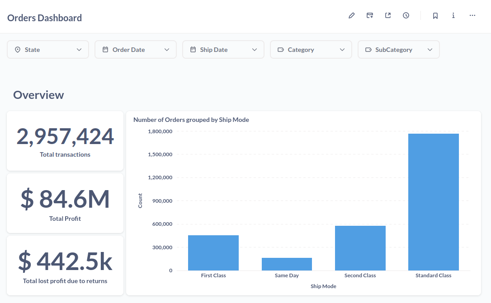

# metabase-postgresql
Example of orders dashboard created with Metabase.

## The Data
CSV data thanks to [Penguin Analytics](https://youtu.be/jEgVto5QME8?feature=shared) (link [here](https://drive.google.com/file/d/11gs4UgN9qBHc7JsI9E7jZN5FkAEu4XgK/view)).
You may download the modified CSV files from this repository. They have changed column names to be imported in Postgresql.

## Postgresql
#### Docker
For the sake of this demo you can simply use the following docker command. Note the `-v` flag which you also need to change to your actual path where you downloaded the CSV files.
```sh
docker run --name postgres -it -p 5432:5432 -v ~/your-folder/csv:/var/lib/csv -e POSTGRES_USER=postgres_user -e POSTGRES_PASSWORD=postgres_password -e POSTGRES_DB=myDataBase postgres
```

Then, you need access to the psql cli:
```sh
docker exec -it postgres psql -U postgres_user -d myDataBase
```

If you see this, everything is good:
```
psql (16.1 (Debian 16.1-1.pgdg120+1))
Type "help" for help.

myDataBase=#
```

You can stop the docker container with this command. Replace "stop" with "start" if you want to start it again.
```sh
docker stop postgres
```

#### Tables
Now copy paste each of these commands inside psql and hit enter.

```SQL
CREATE TABLE orders (
    row_ID BIGSERIAL PRIMARY KEY,
    order_ID VARCHAR(50),
    order_date date,
    ship_date date, 
    ship_mode VARCHAR(50),
    customer_ID VARCHAR(50),
    customer_name VARCHAR(50),
    segment VARCHAR(50),
    country VARCHAR(50),
    city VARCHAR(50),
    state VARCHAR(50),
    postal_code INT,
    region VARCHAR(50),
    Product_ID VARCHAR(50),
    category VARCHAR(50),
    sub_category VARCHAR(50),
    product_name VARCHAR(250),
    sales REAL,
    quantity INTEGER,
    discount REAL,
    profit REAL
);

CREATE TABLE returns (
    returned bool,
    order_id VARCHAR(50)
);

CREATE TABLE people (
    person VARCHAR(250),
    region VARCHAR(250)
);
```

Imports from CSV:
```SQL
COPY orders(row_id, order_ID, order_date, ship_date, ship_mode, customer_ID, customer_name, segment, country, city, state, postal_code, region, Product_ID, category, sub_category, product_name, sales, quantity, discount, profit)
FROM '/var/lib/csv/Superstore_Orders.csv'
DELIMITER '|'
CSV HEADER;

COPY returns(returned, order_id)
FROM '/var/lib/csv/Superstore_Returns.csv'
DELIMITER '|'
CSV HEADER;

COPY people(person, region)
FROM '/var/lib/csv/Superstore_People.csv'
DELIMITER '|'
CSV HEADER;
```

When importing you should see this being printed back: `COPY 9994` (for orders).

## Metabase
Run it with docker:
```sh
docker run -d -p 3000:3000 metabase/metabase
```

Now navigate to `localhost:3000` and follow the wizard. You may add any email you like.

In order to configure your Postgresql, note that the IP will not be localhost, but the docker IP instead.
Use this command to find that IP:
```sh
docker inspect -f '{{range .NetworkSettings.Networks}}{{.IPAddress}}{{end}}' postgres
```

### Dashboard


Sorted bar charts are easily implementable:


We may decide not to summarize data, but simply plot it in time:


As the data has states defined, maps are possile:


I also added several filter options. For example, we can drill into the "Tables" sales to see they are loosing money.


Then find the exact order ids when this is happening.

